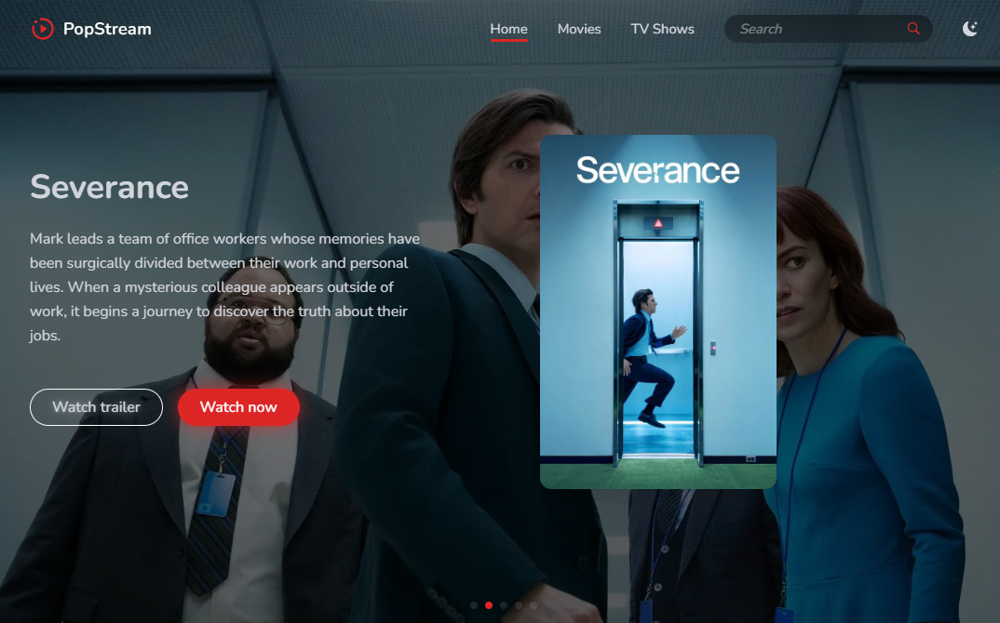
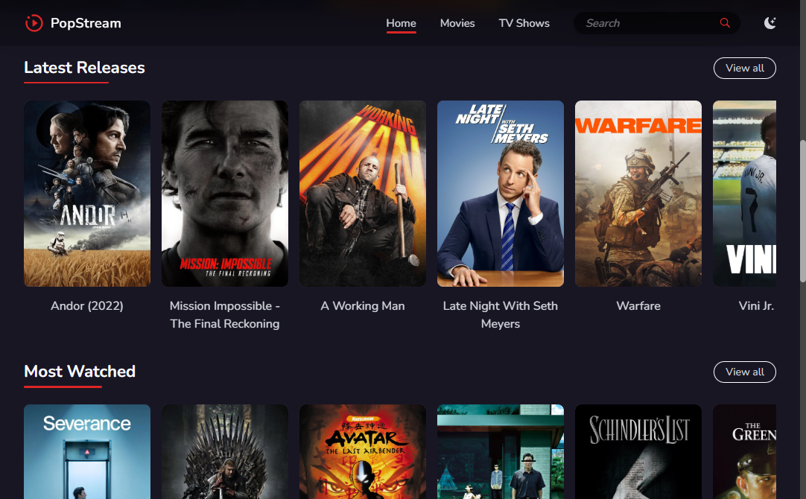
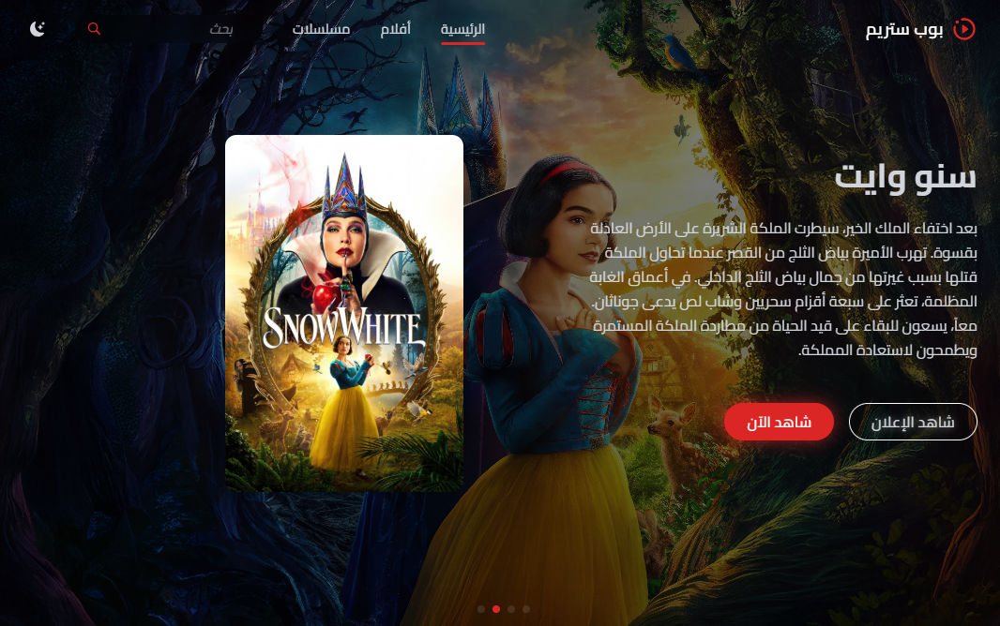

# PopStream

A modern and responsive Movie/TV show streaming platform template built with `TypeScript` and `TailwindCSS`. Features a beautiful UI with dynamic content sliders, theme switching, RTL support and mobile responsiveness.


[View More Screenshots](#screenshots)

## Features

- 🎨 Modern and responsive design
- 🌓 Light/Dark theme support
- 🌐 RTL language support
- 🎭 Dynamic hero slider with trailer previews
- 🔄 Smooth content carousels using Swiper.js
- 📱 Full mobile responsiveness with animated menu
- 🎯 Fully TypeScript enabled
- 🎨 TailwindCSS for styling
- 🚀 Built with Vite for optimal performance

## Performance Insights

This project is optimized for performance and accessibility. Below is a Lighthouse report showcasing the application's excellent scores in key areas such as performance, accessibility, best practices, and SEO.


## Project Structure

```
src/
├── assets/
│   ├── css/
│   │   ├── font-ar.css    # Arabic font styles
│   │   ├── font-en.css    # English font styles
│   │   └── style.css      # Main styles
│   └── js/
│       └── main.ts        # Main TypeScript logic
├── index.html            # Home page
├── browse.html           # Movies/Shows browsing page
├── single.html           # Movie/Show details page
├── about.html           # About page
├── contact.html         # Contact page
├── privacy.html         # Privacy policy page
├── rtl.html             # RTL version
└── 404.html             # Error page
```

## Tech Stack

- Vite 6.3
- TypeScript 5.8
- TailwindCSS 4.1
- Swiper.js for sliders
- PostCSS for optimal CSS output

## Getting Started

1. Clone the repository:

```bash
git clone https://github.com/yourusername/popstream-theme.git
cd popstream-theme
```

2. Install dependencies:

```bash
npm install
```

3. Start the development server:

```bash
npm run dev
```

4. Open your browser and visit `http://localhost:3000`

## Building for Production

To create a production build, run:

```bash
npm run build
```

This will generate optimized static files in the `/dist` directory.

## Contributing

1. Fork the repository
2. Create your feature branch (`git checkout -b feature/amazing-feature`)
3. Commit your changes (`git commit -m 'Add some amazing feature'`)
4. Push to the branch (`git push origin feature/amazing-feature`)
5. Open a Pull Request

## Screenshots

### Hero Section

The main landing page with dynamic hero slider and featured content


### Content Layout

The main content section featuring a swipeable carousel displaying movie and TV show cards in an elegant grid layout



### Single Movie/Show Page

Detailed view of individual movie or TV show with information and related content


### RTL version

RTL (Right-to-Left) version of the template with full Arabic language support and optimized layout direction


